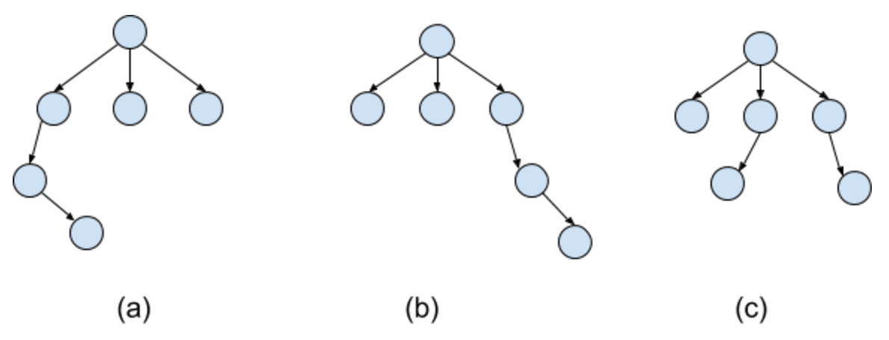

# Challenge 12 - Pika Virus

Recently, there have been reports of a new virus called Pika that is spreading around the world. But, how is this virus spreading across the world? Have there been any other viruses that followed the same trends?


Usually, a virus originates in a city or village and spreads from there to other nearby cities. From these cities, the virus is transmitted from one person to another, even reaching cities in other countries.

Assuming that one pandemic with these characteristics originates in a single city, does it spread in a different manner to other viruses? Which cities are infected with a virus that is equal to the original virus?

Two viruses, a and b, are similar if each city in which virus ‘a’ is present (ai) has an equivalent to another city in which virus ‘b’ is present (bk) and the virus spreads in the same manner (represented as ai/bk).

In the following example, viruses ‘a’ and ‘b’ spread in a similar manner while viruses ‘a’ and ‘c’ spread in a different manner.



**Input**

In the first line, an integer N that represents the numbers of cities infected by the original virus O. The number of jumps made by the virus while the pandemic was ongoing is always N-1. The following N-1 lines indicate the jumps made by the virus. For each line, two cities S, D are written. S indicates where the virus started and D indicates where the virus reached with that jump.

The next line will indicate the number of viruses T you need to compare with the original. For each virus to be compared, there will be N-1 lines to describe how it spreads around the world. They will have the same number of cities and jumps as the virus O.

**Output**

For each case t, the output is the string "Case #t: " followed by the string with the answer. If that virus spreads in a different manner to the original virus, the string answer is ‘NO’. In the event that the viruses spread in the same manner, the string with the answer follows the structure:

a0/b0 a1/b1 … aN/bN
where ai is a city of the original virus and bi is the city related to ai, and ai < ai+1 (alphabetical order). Check the output examples.

**Limits**

3 ≤ N ≤ 100
1 ≤ T ≤ 500

**Assumptions**

The virus starts to spread from one single city.
The name of the cities will not contain spaces.
A city that has been infected by a virus cannot be infected again.
Two viruses A and B spread in the same manner when the following conditions are met:
The same number of cities have been infected by both viruses A and B.
Every city infected by virus A has an equivalent city infected by virus B.
Two cities are equivalent if the following conditions are met:
Both cities have infected the same number of cities.
Both cities have the same number of jumps to the first city where the virus started to spread.
Ancestors of both cities may not be equivalent.
Both cities will have the same spreading (paths) to the last cities where the pandemic was ongoing.
If a city with the original virus (ai) has more than one equivalent from the cities with another virus (bj and bk where bj < bk), it will be related to the first city according to alphabetical order: (ai/bj)
A city with the original virus (ai) cannot have more than one equivalent in the city with another virus (bj) and vice versa. That is, each city with the original virus and each city with another virus must appear once and only once in the output.

**Sample Input 1**
```
6
saidres astrabudua
astrabudua villamiel
astrabudua belad
villamiel galdo
saidres valdestillas
3
foldada niembro
niembro touzas
foldada echalecu
touzas villayon
foldada paradasolana
longra gulpilleiras
gulpilleiras canellas
canellas idiazabal
longra sotolongo
gulpilleiras villarmeao
torms olas
torms ozana
torms claravalls
olas irazola
olas aldeadalba
```

**Sample Output 1**

```
Case #1: NO
Case #2: astrabudua/gulpilleiras belad/villarmeao galdo/idiazabal saidres/longra valdestillas/sotolongo villamiel/canellas
Case #3: NO
```

**Sample Input 2**

```
3
arditurre vall-llebrera
arditurre sumio
4
lazado eraul
eraul ifonche
sacedon cervera
sacedon agrade
lezo vacarisas
vacarisas vinebre
taballes palmar
taballes castrecias
```

**Sample Output 2**

```
Case #1: NO
Case #2: arditurre/sacedon sumio/agrade vall-llebrera/cervera
Case #3: NO
Case #4: arditurre/taballes sumio/castrecias vall-llebrera/palmar
```
