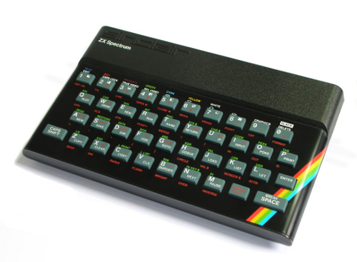

# Challenge 13 - Legacy code

— So, you're the consultant assigned to the project? The engineer who knows old programming languages?

— Of course. I'm an expert in old languages such as Fortran or Cobol. Do you know Cobol? It's a...

— Yes, yes. Well, I'm glad to hear that. This is our old application. It has written an ultra-important secret message. We need you to recover that message and return it to us.

— No problem, I'll have it in a few minutes. What language is it?

— Great! Not a big deal. It's machine code, for the Sinclair ZX Spectrum.

Silence.
Looks like I picked the wrong day to quit smoking.

**Input**

It is a file with the binary code, originally loaded in the address 0x8100.

**Output**

The hidden message that the application is intended to print on the screen.

