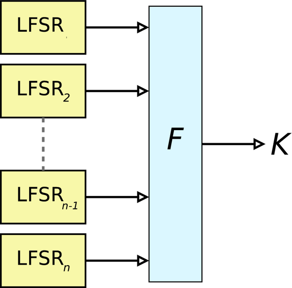

# Challenge 18 - Decipher the message « Prev Next »



Many people say that you shouldn't roll your own crypto, but who cares! We've found a completely secure cipher! We're so sure it's safe that we're even giving you its code and a ciphertext. Can you prove us wrong?

**Input**

The ciphertext

**Output**

The plaintext

NOTE: In this level, the output for the submit phase is the same as the output for the test phase.
```
#!/usr/bin/env python
import sys

def cipher(pt):
    l = len(pt)
    k = l // 2
    ct = ''
    for i in range(l):
        ct += hex(ord(pt[i]) ^ ord(pt[k]))[2:].zfill(2)
        if ord(pt[i]) % 3 == 0:
            k = (k + 1) % l
        elif ord(pt[i]) % 3 == 1:
            k = (k - 1) % l
        else:
            k = l // 2
    return ct

sys.stdout.write(cipher(open('solution.txt').read()))
```
